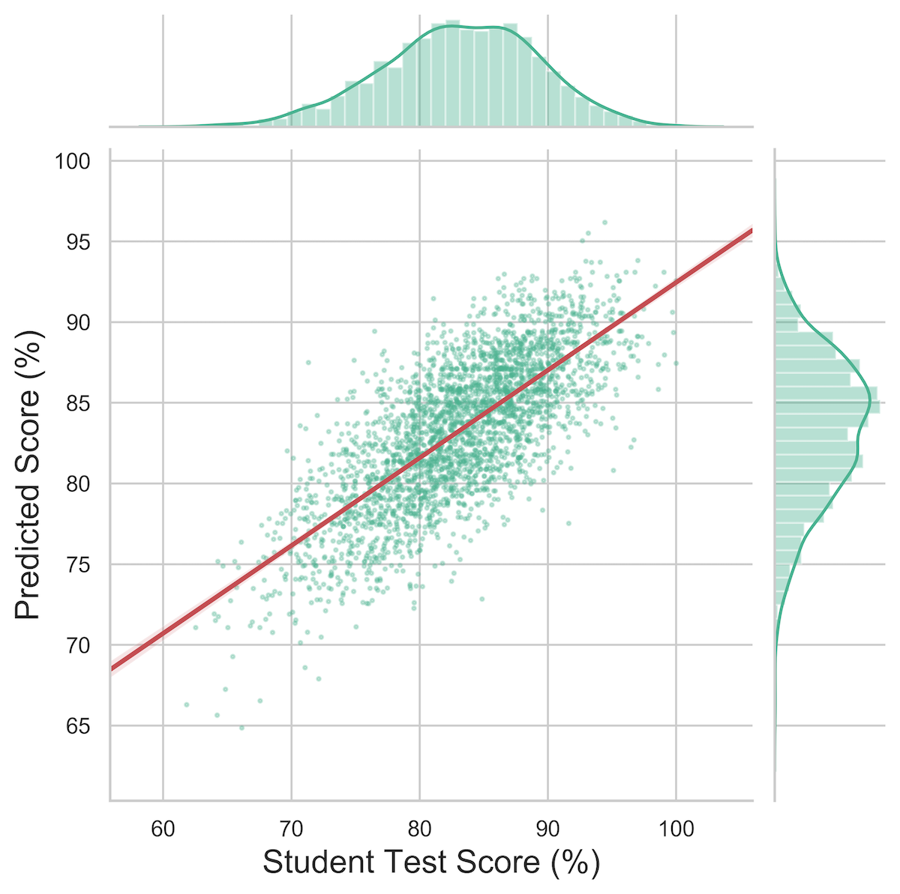

# Here To Learn - Django & Jupyter Notebook

## Description
 [Django application](http://lit-fortress-28598.herokuapp.com/) utilizes a machine learning model trained with over 300,000 data points to predict test outcomes for 5,000 mock students based on eating and sleeping habits for each student.

 This [Jupyter Notebook](https://github.com/blake-enyart/heretolearn_django/blob/master/jupyter_notebook/ml-generator.ipynb) demonstrates:
* Data generation
* JSON API conversion to pandas DataFrame
* Data munging (dummy variables for nominal categorical sleep data)
* Hyperparameter optimization & model selection in RandomSearchCV
* Gradient boosted model training
* matplotlib and seaborn visualization

 This app integrates with [HereToLearn](https://young-anchorage-86985.herokuapp.com), a Rails application, which presents the data and serves as the interface for teachers and students.

**Rails App Integration Highlight:**
* Chart.js presentation

## Contributing
* [Blake Enyart](https://github.com/blake-enyart) - Django app, data visualization (chart.js, seaborn, matplotlib), machine learning implementation
* [William Peterson](https://github.com/wipegup) - Provided input and mentoring on the machine learning model development

## Django App Goals
* Work with two other applications, a [Sinatra microservice](https://aqueous-caverns-33840.herokuapp.com) and a [Rails application](https://young-anchorage-86985.herokuapp.com)
* Predict student test scores using machine learning model developed [here](https://github.com/blake-enyart/heretolearn_django/blob/master/jupyter_notebook/ml-generator.ipynb)

## Highlights
#### Tech Stack


#### Analysis


## Setup/Configuration
```
python3 -m venv env
source env/bin/activate
pip install -r requirements.txt
psql
CREATE DATABASE heretolearn_production;
CREATE USER heretolearn WITH PASSWORD 'badgers';
GRANT ALL PRIVILEGES ON DATABASE heretolearn_production TO heretolearn;
\q
python manage.py migrate
python manage.py runserver
 ```
